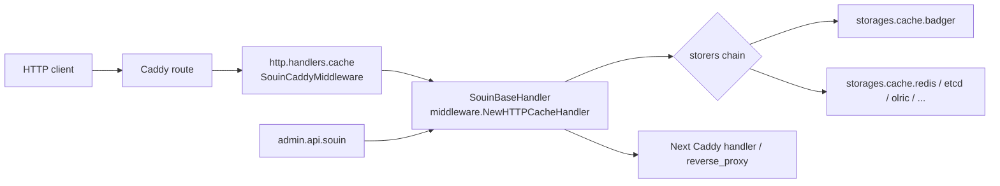
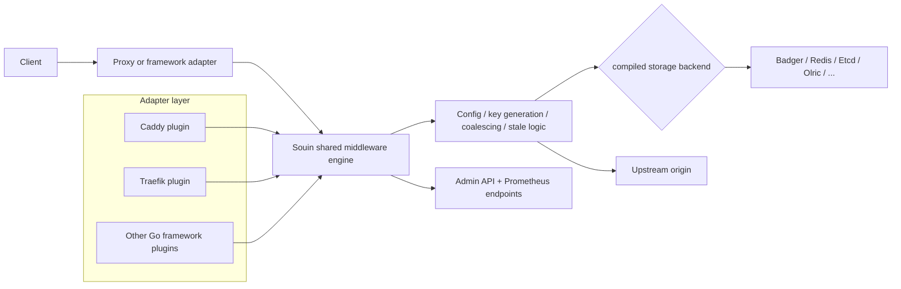
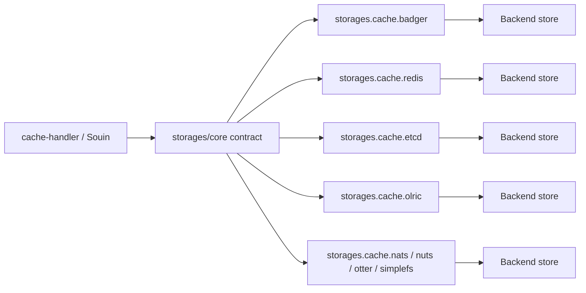
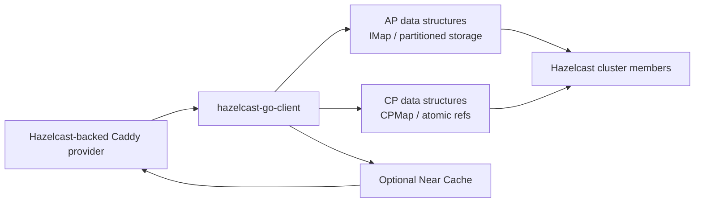
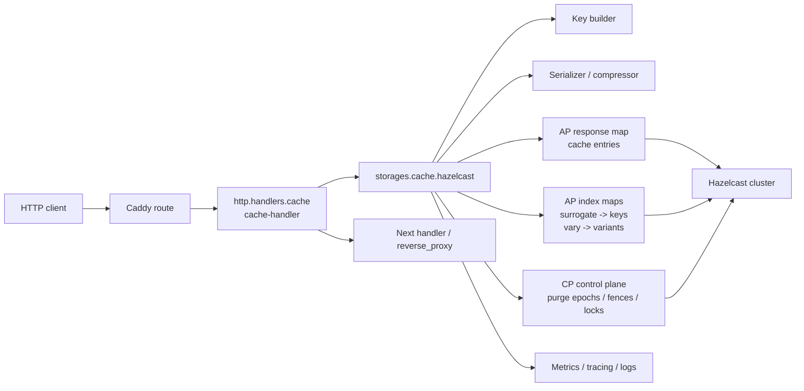
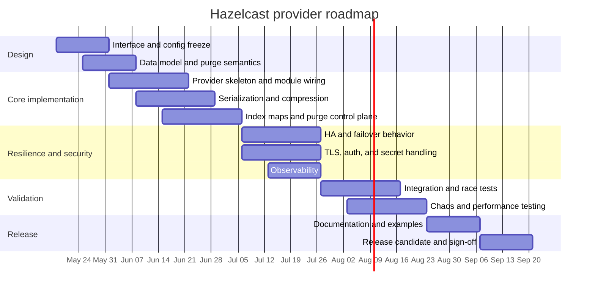

# Hazelcast as a Caddy Cache Backend

## Executive summary

No public, maintained Caddy cache implementation using Hazelcast as its storage backend surfaced in the primary-source review. GitHub repository search and code-search combinations for `hazelcast caddy`, `hazelcast souin`, and `hazelcast cache-handler` returned no direct results, while the currently supported storage lists in the active Caddy/Souin ecosystem explicitly include Badger, Etcd, Go-Redis, NATS, Nuts, Olric, Otter, Redis, and SimpleFS, but not Hazelcast. citeturn4view0turn4view1turn4view2turn48view0

The useful public code to study is therefore indirect: the stable Caddy-facing wrapper urlcaddyserver/cache-handlerturn1search0, the upstream cache engine urldarkweak/souinturn1search5, the backend extension repository urldarkweak/storagesturn13search1, and the official urlhazelcast-go-clientturn4search7. The first two repositories themselves say that Souin is the development stream and `cache-handler` is the stabilized production-facing stream; both also state that, since Souin `v1.7.0`, storage backends are no longer bundled and must be added separately at build time from the storages repository. citeturn8view0turn40view0

For an enterprise production environment, the best path is **not** to hunt for an existing Hazelcast+Caddy plugin to adopt, because none was found in public sources. The best path is to **implement a new Hazelcast provider on the existing extension seam**—targeting the stable `cache-handler`/Souin storage module contract—while using the official Hazelcast Go client as the transport and cluster API layer. If Hazelcast is optional, the lower-risk near-term choice is to run `cache-handler` with an already-supported backend such as Redis or Etcd while the Hazelcast provider is built and hardened. Caddy’s own module documentation also reminds users that non-standard modules are community-developed and not officially endorsed or maintained by the Caddy project, which matters for enterprise support posture. citeturn18view0turn14view0turn8view2turn12view1

| Decision path | Verdict | Why |
|---|---|---|
| Adopt an existing public Caddy+Hazelcast backend | **Avoid** | No public implementation was found in the reviewed primary sources. |
| Use Souin or cache-handler “as-is” for Hazelcast | **Avoid** | Current supported backend lists do not include Hazelcast. |
| Build a Hazelcast provider against the current storage extension points | **Recommended** | Reuses the existing Caddy integration surface, admin API, purge model, and config style. |
| Contribute upstream after hardening | **Recommended** | Aligns with the ecosystem, but only after enterprise-grade testing and version discipline. |

## Research scope and inventory

The review prioritized public source repositories, commit histories, release pages, workflow definitions, Caddy documentation, Hazelcast documentation, and relevant RFC references exposed directly from project READMEs. The central result is simple: **direct public Hazelcast backend implementations for Caddy cache were not found**; the public ecosystem currently exposes the wrapper, the upstream cache engine, the storage-provider seam, and the official Hazelcast client. citeturn4view0turn4view1turn4view2turn48view0turn8view2

| Project | Role in the ecosystem | Repository | License | Last visible commit | Maintainer(s) visible from recent activity | Language | Stars / Forks | CI status | Release artifacts | Sources |
|---|---|---|---|---|---|---|---|---|---|---|
| `cache-handler` | Stable Caddy-facing cache module | urlcaddyserver/cache-handlerturn1search0 | Apache-2.0 | 2025-07-08 | `darkweak` is the visible release author and most recent committer; repo hosted under `caddyserver` | Go | 380 / 27 | GitHub Actions present; latest visible run **Success** | Latest visible release `v0.16.0`; **2 assets** | citeturn8view0turn9view0turn11view0turn27view0turn45view0 |
| `souin` | Upstream cache engine and development stream | urldarkweak/souinturn1search5 | MIT | 2026-03-12 | `darkweak` is the dominant releaser; recent contributors include `cdaguerre`, `everyx`, `stepbrobd` | Go | 963 / 78 | GitHub Actions workflows are active; recent validation runs are listed | Latest visible release `v1.7.8`; **12 assets** | citeturn10view1turn12view0turn44search0turn47search0turn41view0 |
| `storages` | Storage-provider extension seam for Souin/Caddy | urldarkweak/storagesturn13search1 | MIT | 2026-03-14 | `darkweak` is the visible releaser; recent low-level fixes by `everyx` and others | Go | 15 / 15 | GitHub Actions workflows are present in repo; release/test automation visible; anonymous status is not fully surfaced | Latest visible release `v0.0.19`; **2 assets** | citeturn48view0turn49view0turn47search1turn13search3 |
| `hazelcast-go-client` | Official client dependency candidate for a new provider | urlhazelcast-go-clientturn4search7 | Apache-2.0 | 2026-05-07 | Hazelcast engineering team; recent activity by `JackPGreen`, `yuce`, `g-donev` | Go | 201 / 60 | GitHub Actions present; active maintenance visible through commits and releases | Latest visible release `v1.5.0`; **2 assets** | citeturn8view2turn9view4turn12view1turn46view0 |

A separate but important inventory result is that the storage extension repo’s own supported-backend list excludes Hazelcast, and the Makefile test matrix explicitly enumerates providers other than Hazelcast. That absence is not accidental; it is structurally visible in the code and docs. citeturn48view0turn13search3

## Project deep dives

Because no direct public Caddy+Hazelcast backend was found, the relevant architectural patterns come from the three Caddy/Souin repositories and the official Hazelcast client. citeturn4view0turn48view0turn8view2

**Project: urlcaddyserver/cache-handlerturn1search0**

`cache-handler` is a comparatively thin but important layer: it registers a Caddy HTTP handler module with ID `http.handlers.cache`, registers both a Caddyfile global option and a handler directive named `cache`, exposes an admin module `admin.api.souin`, and dynamically loads storage modules by ID using the pattern `storages.cache.<name>`. In other words, it is the stable Caddy integration seam, not the place where a brand-new storage transport should re-invent the whole cache engine. Its own README explicitly says Souin is the development stream and `cache-handler` is the stable production stream. citeturn18view0turn15view3turn8view0

| Aspect | Findings |
|---|---|
| Key modules / classes | `SouinCaddyMiddleware`, `Configuration`, `DefaultCache`, `adminAPI`, and the cleanup/storage registry helpers in `cleaner.go`. citeturn18view0turn20view0turn15view4turn16search3 |
| Integration points with Caddy | Registers `http.handlers.cache`; parses both global and route-local `cache` blocks; registers `admin.api.souin`; dispatches storage providers through `ctx.LoadModuleByID("storages.cache."+name, ...)`. citeturn18view0turn15view3 |
| Configuration surface | `ttl`, `stale`, `timeout`, `allowed_http_verbs`, `allowed_additional_status_codes`, `headers`, `key`, `cache_keys`, `default_cache_control`, `cache_name`, `max_cacheable_body_bytes`, `storers`, `disable_coalescing`, `disable_surrogate_key`, `api`, and backend blocks for `badger`, `etcd`, `redis`, `olric`, `nats`, `nuts`, `otter`, and `simplefs`; there is no Hazelcast block. citeturn18view0turn20view0turn21view1turn21view2turn21view4 |
| Dependency shape | Depends on Caddy v2, Souin, and `storages/core`; since Souin `v1.7.0`, extra storages are added at build time from a separate storages repo. citeturn8view0turn18view0 |
| Testing and coverage | A large `httpcache_test.go` exercises end-to-end behavior with `caddytest`, including stale handling, vary behavior, auth-sensitive keys, `must-revalidate`, ETags, huge max-age, and concurrent request patterns. CI builds via `xcaddy`, runs `go test -coverprofile -race ./...` on Ubuntu and macOS, and runs `golangci-lint`. No public coverage threshold or percentage is published. citeturn34view1turn24view0turn27view0 |
| Known issues / security concerns | Public issues and forum threads show Redis configuration pitfalls, Redis hits/miss inconsistencies, a Unix-socket panic path, coalescing concerns on mixed cacheability, earlier badger config panics, and reports of high CPU/memory. The biggest enterprise security concern is not Hazelcast-specific; it is incorrect cache-key construction or coalescing on authenticated/private variants. citeturn35search0turn35search2turn35search3turn35search6turn35search12turn35search14turn35search17 |
| Code quality notes | The wrapper is small and understandable, but a lot of config parsing lives in one file, and there are some signs of maintenance residue, such as comments in the Souin admin module still referring to PKI endpoints. CI also still emits deprecated `set-output` warnings, and Windows build coverage is disabled in workflow comments. citeturn15view4turn24view0turn27view0 |

This diagram reflects the registration and dispatch flow visible in `httpcache.go`, `configuration.go`, and `admin.go`. citeturn18view0turn20view0turn15view3



The production verdict on `cache-handler` is nuanced. It is the **right Caddy-facing anchor** for enterprise use because it is the deliberately stabilized wrapper, but it is **not** a Hazelcast solution and it inherits the behavior, bugs, and operational characteristics of the underlying storage providers and the upstream Souin engine. For enterprise deployment, it is adoptable **only** as the front door of a controlled cache stack, not as a reason to avoid writing a proper Hazelcast provider. citeturn8view0turn14view0turn27view0

**Recommendation:** **Adopt** as the stable Caddy integration layer, **contribute** fixes where needed, and **avoid** treating it as a complete Hazelcast answer.

**Project: urldarkweak/souinturn1search5**

Souin is the core cache engine and the design source for most behavior. Its README positions it as a reverse-proxy cache system with RFC-oriented features such as `Vary`, stale cache-control handling, request coalescing, Cache-Status support, purge APIs, surrogate/YKey concepts, and multi-proxy/plugin integrations, including a Caddy plugin. Since `v1.7.0`, it also externalized storage backends into a separate storages repository. citeturn40view0turn38search0

| Aspect | Findings |
|---|---|
| Key modules / classes | Major top-level modules include `configuration`, `configurationtypes`, `pkg`, `plugins`, `tests`, and `gatling`; the README and repository tree show a shared engine with many framework adapters rather than a Caddy-specific-only implementation. citeturn10view1turn40view0 |
| Integration points with Caddy | The Caddy adapter lives under `plugins/caddy`; Souin’s README shows building it with `xcaddy build --with github.com/darkweak/souin/plugins/caddy`, and after `v1.7.0` additional storage adapters must be compiled in separately. citeturn8view1turn40view0turn43view0 |
| Configuration surface | Souin documents global API endpoints, Prometheus metrics, a Souin admin API, `cache_keys` tuning, CDN integration, TTL/stale/default cache control, and per-provider blocks; the Caddy example file shows concrete blocks for Badger, Etcd, NATS, Nuts, Redis, Vary handling, max-age, surrogate keys, custom key templates, auth-sensitive keys, and timeout tuning. citeturn40view0turn38search0 |
| Dependency shape | Direct dependencies include Caddy v2, `storages/core`, `xxhash`, `lz4`, `cachecontrol`, Prometheus client libraries, `zap`, `x/sync`, protobuf, and YAML. citeturn41view0 |
| Testing and coverage | The repo contains `tests`, `gatling`, and plugin-specific build targets; the Makefile has explicit `tests`, `coverage`, and `build-caddy` targets, and the GitHub Actions workflow list shows recent “Build and validate Souin as plugins” runs through March 2026. Coverage tooling exists, but no public numeric threshold is surfaced in the reviewed sources. citeturn10view1turn43view0turn44search0 |
| Observability | Souin documents both a Prometheus API and a Souin management API with list/purge capabilities. That is better than many ad-hoc caching plugins, but enterprise telemetry still depends heavily on how the chosen storage backend is instrumented. citeturn40view0 |
| Known issues / security concerns | Public issues include a Caddy-plugin panic, incorrect client control over cache use with `Pragma: no-cache`, cases of blank pages being cached after canceled contexts, confusion over supported providers, and unresolved operational questions like disk-use limiting. Recent commit history also shows active fixes around singleflight body duplication, simultaneous evictions, surrogate-key regex performance, and Caddy lifecycle/reset behavior. citeturn39search2turn39search4turn39search5turn39search6turn39search7turn12view0 |
| Code quality notes | Souin is feature-rich and active, but it is also the churn point. The breadth of integrations is a strength for patterns and reuse, yet it increases surface area, upgrade complexity, and the probability of regressions. The maintainer concentration around `darkweak` is also visible in commits and releases. citeturn12view0turn47search0 |

This diagram is a synthesis of the repository structure, README, and build targets. citeturn40view0turn43view0



Souin is **architecturally the most informative project** for building a new provider, but it is **not the safest enterprise runtime anchor** if consumed directly from the development stream. Its public issue history and recent fix velocity show that it is still where subtle concurrency, lifecycle, and behavior bugs are actively resolved. That is not a deal-breaker for open source; it is a warning against pinning enterprise production to `master` or to fast-moving upstream changes without a compatibility buffer. citeturn39search2turn39search6turn39search7turn12view0

**Recommendation:** **Contribute** to its architecture and interfaces, **avoid** using the development stream directly as your enterprise deployment base, and **treat it as the reference design**, not the final operational product.

**Project: urldarkweak/storagesturn13search1**

The storages repository is the most important codebase for a Hazelcast implementation because it is now the formal backend-extension seam. Its README states that each storage is available as a Caddy module, built with the pattern `xcaddy build --with github.com/darkweak/storages/{your_storage}/caddy`, and its supported backends list is explicit. A Hazelcast provider would sit here most naturally, or at least emulate this repo’s packaging and module IDs exactly. citeturn48view0turn18view0

| Aspect | Findings |
|---|---|
| Key modules / classes | The repo is structured around `core` plus provider packages (`badger`, `etcd`, `go-redis`, `nats`, `nuts`, `olric`, `otter`, `redis`, `simplefs`), each with a `caddy` submodule. citeturn48view0 |
| Integration points with Caddy | The intended integration is per-provider Caddy modules built separately; this matches `cache-handler`’s dynamic dispatch pattern `storages.cache.<name>`. citeturn48view0turn18view0 |
| Configuration surface | The generic provider model uses `URL`, `Path`, and arbitrary nested `Configuration`; provider-specific nested config is parsed in the Caddy-layer and passed through. That shape is exactly what a Hazelcast provider should honor. citeturn21view0turn48view0 |
| Dependency shape | Each Caddy shim depends on Caddy v2 plus its provider package and `storages/core`; provider packages then depend on their backend libraries. The Badger Caddy shim, for example, depends on Caddy v2.11.2, `storages/badger`, and `storages/core`. citeturn13search2 |
| Testing and coverage | The Makefile runs race-enabled tests for `badger`, `core`, `etcd`, `go-redis`, `nats`, `nuts`, `otter`, `redis`, and `simplefs`, but **not Olric**, which is conspicuously absent from `TESTS_LIST`. Public numeric coverage is not surfaced. citeturn13search3 |
| Known issues / security concerns | Recent release and commit history shows fixes for response truncation caused by buffer-reuse race, unsafe memory access in Badger, reset/cleanup connection lifecycle issues, SimpleFS race conditions, and multiple-instance problems in Otter. These are reliability-critical bugs in exactly the layer that would be reused for Hazelcast. citeturn47search1turn49view0 |
| Code quality notes | The modularization is good and the seam is usable, but the repo is young, has low community scale, and still needed several recent concurrency and unsafe-memory fixes. That is a sign of an extension point worth using, but not one to trust blindly without a much stronger quality regimen for a new enterprise backend. citeturn48view0turn49view0 |

This diagram is reconstructed from the repo structure, build instructions, and the `cache-handler` dispatch logic. citeturn48view0turn18view0



For a Hazelcast backend, this repo is the **best insertion point**. It already expresses how a storage provider should be split into a core package and a Caddy-facing shim, how it should be built, and how it should be discovered. But it is not yet “enterprise by default”; the recent race and memory-safety fixes are exactly the kinds of bugs that enterprise change boards will scrutinize. citeturn47search1turn49view0

**Recommendation:** **Contribute and extend**. This is where a Hazelcast provider belongs conceptually. **Avoid** assuming that matching the existing test posture is enough; exceed it substantially.

**Project: urlhazelcast-go-clientturn4search7**

The official Hazelcast Go client is not a Caddy cache project, but it is the correct implementation base for a serious new provider. The repo describes Hazelcast as a distributed in-memory data store and computation platform, says the Go client communicates with Hazelcast 4.x and 5.x clusters, and shows active maintenance through May 2026. Recent release notes also show work on strong-consistency primitives such as `CPMap`, and earlier releases fixed failover and connection-timeout behavior. citeturn8view2turn12view1turn46view0

| Aspect | Findings |
|---|---|
| Key modules / classes | The repo structure includes `client.go`, `config.go`, `cluster`, `nearcache`, `serialization`, `sql`, `internal`, and a large number of unit and integration test files. citeturn10view2turn8view2 |
| Integration point with Caddy | None directly. It is the transport, topology, serialization, and cluster-behavior dependency for a future provider module. |
| Features relevant to a provider | Supports Hazelcast 4.x and 5.x, Go 1.20+, Near Cache support, and `CPMap` / CP atomic references in recent releases. That gives enough surface to design an AP/CP hybrid provider rather than a purely eventually-consistent cache. citeturn8view2turn4search4turn46view0turn5search15 |
| Testing and coverage | The repo includes many `*_it_test.go` integration tests and a `coverage.sh` script, which is stronger evidence of disciplined client testing than any cache-specific Hazelcast+Caddy code that was found—because none was found. citeturn10view2 |
| Known issues / security concerns | Earlier release notes mention fixes around failover and connection timeouts, which is good evidence of operational maturity, not instability. The current risk is not the client itself so much as how a provider would map HTTP cache semantics onto Hazelcast data structures. citeturn46view0 |
| Code quality notes | This is the healthiest and most enterprise-ready codebase in the stack. It has recent activity, official ownership, release discipline, and richer testing than the bespoke cache modules. citeturn12view1turn46view0 |

This diagram represents the role the official client would play inside a future provider. citeturn8view2turn46view0turn5search16turn5search15



**Recommendation:** **Adopt** as the implementation dependency. Do not try to talk to Hazelcast at the wire/protocol level yourself.

## Enterprise readiness and adoption decisions

A strict enterprise view should evaluate not only feature fit but also bug surface, maintenance signals, supportability, and semantic fit for HTTP caching. The table below reflects that standard.

| Project | Stability | Performance | Scalability | HA / failover | Consistency model | Security posture | Observability | Upgrade / migration path | Support / maintenance | License compatibility | Community activity | Enterprise decision |
|---|---|---|---|---|---|---|---|---|---|---|---|---|
| `cache-handler` | Medium | Medium | Medium | Medium, backend-dependent | Backend-dependent | Medium | Medium | Medium | Medium | Strong | Medium | **Adopt as stable wrapper; not a Hazelcast solution** |
| `souin` | Medium-low for direct enterprise runtime | Medium-high | Medium | Medium | Mixed; backend-dependent | Medium | Medium-high | Medium-low because of churn | Medium-high activity, but concentrated maintainer base | Strong | High relative to peers | **Contribute/reference; avoid direct dependency on fast-moving stream** |
| `storages` | Medium-low | Medium | Medium | Medium, backend-dependent | Backend-dependent | Medium-low | Low-medium | Medium-low | Medium-low | Strong | Low | **Best extension point; requires heavy extra hardening** |
| `hazelcast-go-client` | High | High | High | High | Stronger options available via CP primitives | High | Medium | High | High | Strong | Medium | **Adopt as base dependency** |

The most important production conclusion is this: **there is nothing public to “use in production” today if Hazelcast is a hard requirement**. The current public projects either provide the Caddy integration layer, the upstream engine, or the extension seam; none provides the actual Hazelcast provider. That immediately shifts the decision from “adopt vs. build” to “what is the least risky way to build.” citeturn4view0turn48view0turn18view0turn8view2

The least risky way to build is **not** to fork the entire cache engine. It is to preserve the stable, existing Caddy integration surface and add a provider that looks like the current storages architecture. `cache-handler` already knows how to load named storage modules; the storages repo already defines the packaging pattern; Souin already defines the behavior and admin API expectations; and the official Hazelcast Go client already gives you a maintained cluster library. That lets you own only the part you actually need: HTTP-cache-to-Hazelcast mapping. citeturn18view0turn48view0turn40view0turn8view2

A practical decision matrix is therefore:

| Scenario | Recommendation |
|---|---|
| Hazelcast is optional and delivery speed matters | Use `cache-handler` with an already-supported backend now, and defer Hazelcast. |
| Hazelcast is mandatory but business-critical correctness matters | Build a new provider against the existing extension seam, with a formal test/chaos/performance program. |
| You were considering deploying Souin `master` or an ad-hoc Hazelcast fork directly | Do not do that in an enterprise setting. |
| You want a credible open-source contribution path | Start in a dedicated provider repo, preserve the `storages.cache.hazelcast` module shape, then upstream once stable. |

## Design for a new Hazelcast provider

The right target is a **production-grade provider module** that plugs into the existing discovery path and Caddy build flow. The best-fitting module ID is `storages.cache.hazelcast`, matching the existing convention used by `cache-handler` when it dispatches and loads storers dynamically. citeturn18view0turn48view0

**Goals and scope**

| Area | Recommended target |
|---|---|
| Primary goal | Cluster-aware distributed cache storage backend for Caddy/Souin using Hazelcast |
| Compatibility target | `cache-handler` stable branch first; Souin `v1.7.x` behavior model; `storages/core` extension style |
| Supported deployment modes | Containers, Kubernetes, VMs, bare metal; no platform-specific assumptions |
| Required semantics | Fresh hits, stale serving, purge by key and surrogate, predictable multi-node behavior, safe reloads, explicit auth-sensitive keying |
| Non-goals for v1 | Full CDN purge orchestration, near-cache-by-default, custom wire protocol, bespoke admin API detached from Souin |

**Recommended repository shape**

A clean initial shape is:

- `github.com/your-org/storages-hazelcast` — core provider package
- `github.com/your-org/storages-hazelcast/caddy` — Caddy module shim exposing module ID `storages.cache.hazelcast`

That shape mirrors the existing provider split and keeps the provider independently releasable while remaining friendly to later upstreaming.

**Proposed architecture**

This architecture follows the current Caddy/Souin storage seam while using Hazelcast features in a way that matches HTTP cache semantics more closely than a naive “store bytes in one distributed map” approach. Hazelcast documents partitioning and backup replication for its distributed data structures, and its CP subsystem provides strongly consistent data structures such as `CPMap`; the Go client now exposes `CPMap` support directly. citeturn5search16turn5search15turn46view0



**API and compatibility with Caddy**

The provider should preserve the current build pattern used by `cache-handler` and the storage modules. The existing projects already compile custom Caddy binaries with extra `--with` modules, and the provider block should live naturally inside `cache { ... }`. citeturn8view0turn48view0turn43view0

Proposed build pattern:

```bash
xcaddy build \
  --with github.com/caddyserver/cache-handler \
  --with github.com/your-org/storages-hazelcast/caddy
```

Proposed Caddyfile shape:

```caddyfile
{
    cache {
        ttl 5m
        stale 30s
    }
}

example.com {
    route /api/* {
        cache {
            storers hazelcast

            hazelcast {
                cluster_name prod-cache
                addresses hz-0:5701 hz-1:5701 hz-2:5701

                tls {
                    ca_cert_file /etc/certs/ca.pem
                    cert_file /etc/certs/client.pem
                    key_file /etc/certs/client.key
                    server_name hazelcast.internal
                }

                map responses
                surrogate_index surrogate_idx
                vary_index vary_idx
                epoch_map invalidate_epoch

                entry_ttl_strategy stale_horizon
                backup_count 1
                async_backup_count 1
                read_timeout 50ms
                write_timeout 200ms
                compression lz4
            }
        }

        reverse_proxy app:8080
    }
}
```

Those field names are proposed, not existing. The important constraint is to preserve the generic `provider.URL / provider.Path / provider.Configuration` feel from the existing storage ecosystem so JSON and Caddyfile support remain understandable and forwards-compatible. citeturn21view0turn48view0

**Data model**

| Object | Purpose | Suggested Hazelcast structure |
|---|---|---|
| `CacheEntry` | Canonical response object | AP `IMap<string, CacheEntry>` |
| `VariantIndex` | Map a logical key to variant keys derived from `Vary` | AP `IMap<string, []string>` or `IMap<string, VariantSet>` |
| `SurrogateIndex` | Purge-by-tag / surrogate support | AP `IMap<string, []string>` |
| `EpochMap` | Strongly consistent invalidation fence per scope | CP `CPMap<string, uint64>` |
| `Lock / fence` | Serialize purge or migration-critical operations | CP primitive such as fenced locking or CP map CAS-style semantics |
| `Metrics state` | Optional health counters | local process metrics plus exported labels |

Suggested `CacheEntry` fields:

- `Key`
- `StatusCode`
- `Headers`
- `Body`
- `StoredAt`
- `FreshUntil`
- `ServeStaleUntil`
- `CacheControlSnapshot`
- `ETag`
- `LastModified`
- `ContentEncoding`
- `SurrogateKeys`
- `VariantFingerprint`
- `Version`

This design avoids overloading Hazelcast TTL with the full semantics of HTTP freshness. Hazelcast TTL should be treated as **storage garbage collection**, while `FreshUntil` and `ServeStaleUntil` remain application-level correctness fields.

**Consistency and eviction strategy**

The strongest design choice here is a **hybrid AP/CP model**.

For the response bodies and normal lookups, use Hazelcast’s partitioned AP data structures. HTTP cache content is not system-of-record data, and the throughput/latency trade-off is appropriate there. Hazelcast’s platform docs describe automatic partitioning and backup replication across the cluster, which is a good fit for horizontally scaled edge or reverse-proxy caches. citeturn5search16

For purge coordination, invalidation epochs, and any operation where split-brain ambiguity is unacceptable, use a CP primitive. Hazelcast documents `CPMap` as strongly consistent, and the Go client’s recent release explicitly added `CPMap` support. That makes it possible to keep normal reads fast while giving enterprise operators a much stronger guarantee that a purge fence is observed cluster-wide. citeturn5search15turn46view0

Recommended policy set:

| Concern | Recommendation |
|---|---|
| Freshness | Application-level `FreshUntil` |
| Stale serving | Application-level `ServeStaleUntil` |
| Physical retention | Hazelcast entry TTL = stale horizon + safety margin + jitter |
| Purge correctness | Bump an epoch in CP state; treat older entries as invalid even if still physically present |
| Eviction | Prefer provider-side max entry size plus Hazelcast-side memory controls; do not rely on “HTTP caching correctness” from Hazlecast eviction alone |
| Near Cache | Off by default; allow only for low-risk immutable/static endpoints after proving invalidation correctness |

**Clustering and HA design**

The provider should assume a three-member Hazelcast cluster as a minimum production topology, with at least one synchronous backup for response data and one of these two modes:

- **Performance mode:** AP `IMap` entries with synchronous backup, CP epoch map only
- **Strict purge mode:** same as above, but all management operations also pass through CP fencing

A practical enterprise rule is: **body reads may be AP; invalidation control must be CP**.

The client configuration should support:

- multiple member addresses
- smart routing
- client reconnect backoff
- optional failover client configuration for a secondary cluster
- sane per-operation timeouts
- circuit-breaking behavior back to origin when Hazelcast is degraded

The Hazelcast Go client release history shows active work on failover correctness, which is exactly why it should be reused instead of writing a custom network layer. citeturn46view0

**Security design**

Hazelcast’s docs emphasize authentication and TLS/mutual-authentication as first-class security controls. That should map directly into the provider config. citeturn5search13

Recommended security baseline:

| Control | Recommendation |
|---|---|
| Cluster auth | Require non-default cluster name and credentials |
| Encryption in transit | TLS mandatory outside isolated dev environments |
| Client identity | Support mTLS client certs |
| Secret handling | Read credentials from env or files, never inline in examples for production |
| Network scope | Private east-west network only; no public member exposure |
| Multi-tenancy | Namespace maps by tenant or deployment; never share default map names across environments |
| Sensitive response protection | Require explicit key/header configuration for authenticated/private content; add documentation examples that include `Authorization` and content-type headers in keys where appropriate |
| Admin API | Reuse existing Souin/Caddy admin paths, but document that purge endpoints are privileged operations and should sit behind Caddy admin protections and network controls |

**Observability**

Souin already documents a Prometheus metrics endpoint and a management API. A new provider should extend that with provider-specific metrics rather than inventing an entirely new observability plane. citeturn40view0

Recommended emitted metrics:

- `hazelcast_provider_get_total`
- `hazelcast_provider_set_total`
- `hazelcast_provider_delete_total`
- `hazelcast_provider_error_total{op,reason}`
- `hazelcast_provider_latency_seconds{op}`
- `hazelcast_provider_payload_bytes{direction}`
- `hazelcast_provider_epoch_mismatch_total`
- `hazelcast_provider_cluster_connected`
- `hazelcast_provider_member_count`
- `hazelcast_provider_nearcache_hits_total` if Near Cache is enabled

Tracing should annotate:

- lookup miss vs. stale vs. fresh hit
- backend store latency
- compression/serialization time
- purge fan-out cardinality
- epoch rejection events

Logs should be structured and rate-limited around repetitive backend degradation.

**Testing strategy**

The public repos make two things clear: race bugs and lifecycle bugs are real, and the default ecosystem test posture is not yet enough for high-confidence enterprise adoption. The new provider has to go beyond it. Recent fixes in Souin and the storages repo are strong evidence for that. citeturn12view0turn49view0

Recommended test program:

| Test layer | What it must cover |
|---|---|
| Unit tests | serialization, compression, key derivation, TTL/stale math, purge logic, epoch logic, config parsing |
| Integration tests | real Caddy binary via `xcaddy`, real Hazelcast cluster via Docker Compose, multi-node reads/writes, purge APIs, auth-sensitive keys |
| Compatibility tests | `cache-handler` stable branch, Souin behavioral compatibility, multiple Caddy versions |
| Concurrency / race tests | concurrent `GET` / `PURGE`, multi-variant updates, reload during active traffic, provider reset/cleanup semantics |
| Chaos tests | member loss, leader loss in CP subsystem, network partitions, slow member, rolling restart, split-brain protection behavior |
| Performance tests | p50/p95/p99 lookup/store latency, large bodies, high-cardinality surrogate tags, purge storms, stale-while-revalidate bursts |
| Security tests | malformed payloads, credential/TLS misconfiguration, auth-key leakage prevention, admin-path exposure checks |

Recommended quantitative gates before `v1.0.0`:

- `go test -race ./...` mandatory in CI
- integration suite against Hazelcast cluster mandatory
- no panics on config errors; typed validation errors only
- no stale reappearance after confirmed purge in chaos test matrix
- coverage threshold for provider package: at least 80 percent line coverage, with critical branches explicitly asserted
- benchmark budget documented and versioned

**CI/CD, release, docs, governance**

| Area | Recommendation |
|---|---|
| CI | GitHub Actions matrix on Linux/macOS; run `xcaddy build`, unit tests, integration tests with Hazelcast containers, race detector, lint, vulnerability scan |
| Release | Semantic versioning; source archive + checksums + SBOM + signed tags |
| Version policy | Pin and publish a compatibility matrix for Caddy, cache-handler, Souin, storages/core, Hazelcast cluster, and Go |
| Documentation | Quickstart, production hardening guide, upgrade guide, authenticated-content guide, purge semantics guide, performance tuning guide |
| Governance | `CODEOWNERS`, `SECURITY.md`, support window policy, CONTRIBUTING guide, release checklist |
| License | Prefer Apache-2.0 for explicit patent grant and easy alignment with Caddy and Hazelcast dependencies |

## Delivery roadmap and risk management

A realistic delivery plan should assume that the first working code is **not** the hardest part. The harder part is correctness under concurrency, purge determinism, and operational hardening around reloads, partial failures, and cluster churn.

**Estimated effort**

| Workstream | Person-weeks |
|---|---|
| Interface design and config model | 2 |
| Core provider and Caddy shim | 3 |
| Serialization, compression, and entry schema | 2 |
| Variant/surrogate indexing and purge control plane | 3 |
| Security, TLS, and auth integration | 2 |
| Observability and tracing | 2 |
| Integration, race, chaos, and performance testing | 4 |
| Docs, release automation, and hardening | 2 |
| **Total** | **20 person-weeks** |

That usually means either:

- **one senior Go engineer** full-time for about **16 to 20 weeks**, with part-time SRE and QA help, or
- **two engineers** for about **8 to 10 weeks**, again with part-time SRE and QA support.

**Milestones**

| Milestone | Exit criterion |
|---|---|
| Design freeze | Module ID, config schema, data model, and compatibility matrix agreed |
| Alpha | Caddy build works; basic get/set/delete against Hazelcast cluster |
| Beta | Purge, stale serving, multi-node behavior, and Prometheus metrics working |
| Release candidate | Race/chaos/perf gates passed; docs complete; upgrade path documented |
| `v1.0.0` | Stable API, signed release, support policy, no unresolved correctness bugs |

**Primary risks and mitigations**

| Risk | Why it matters | Mitigation |
|---|---|---|
| Stale data surviving purge | Enterprise operators usually care more about purge correctness than about cache hit ratio | Hybrid AP/CP design with epoch fencing; purge tests under partition and restart |
| Memory pressure from large bodies | Distributed caches fail expensively when response bodies are unconstrained | Enforce `max_cacheable_body_bytes`, optional compression, benchmark large-body workloads |
| Split-brain ambiguity | AP-only design can serve invalidated objects in pathological cases | Keep body storage AP, but move invalidation coordination into CP state |
| Reload / cleanup leaks | The Caddy/Souin ecosystem has already seen reset/cleanup fixes | Add explicit reload tests, double-provision tests, and resource cleanup assertions |
| Upgrade churn in upstreams | Souin and storages are still evolving | Pin major/minor compatibility, add adapter layer, test against exact supported versions |
| Authenticated-content leakage | Cache keys that omit sensitive dimensions can cross-user leak | Provide secure-by-default examples and optional validation warnings when auth headers are bypassed |

The recommended rollout plan is shown below.



The final recommendation is straightforward. If Hazelcast is a hard requirement, **build your own provider**, but **do not build the whole cache stack from scratch**. Reuse the existing `cache-handler`/Souin extension surface, mimic the `storages` packaging pattern, and depend on the official Hazelcast Go client. That is the shortest path that still respects enterprise concerns about maintenance, supportability, and correctness. The public evidence supports reusing the architecture; it does not support adopting an existing Hazelcast backend, because no such public backend was found. citeturn4view0turn48view0turn18view0turn8view2